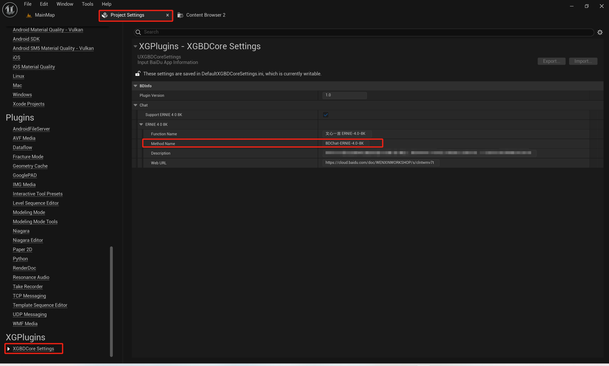
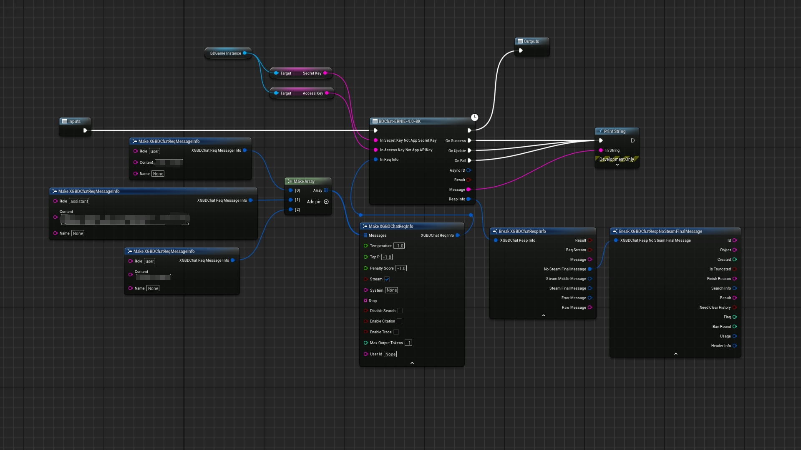

# XGBDLink  
Plugin Version:1.0
## Brief  

&emsp;&emsp;This is XGBDLink project,which it helps to connect Baidu with UnrealEngine 5.</br>
&emsp;&emsp;At pressent,It contains some functions :</br>
&emsp;&emsp;Chat With Ernie Bot</br>
&emsp;&emsp;TODO more...</br>
&emsp;&emsp;It contains two parts:</br>
&emsp;&emsp;"Picture":There are some pictures used by this document.</br>
&emsp;&emsp;"XGBDLinkDemo":The project shows you how to quickly use this plugin.Before you start it,you should purchase the plugin and install it to UnealEngine 5.Then,you should prepare some necessary resources(text,auido,img...).You must register your App info from Baidu Web by yourself.</br>
&emsp;&emsp;UE Marketplace URL:</br>
&emsp;&emsp;[XGBDLink-TODO]()</br>
&emsp;&emsp;Chinese Instruction URL:</br>
&emsp;&emsp;[中文说明书-TODO]()</br>
&emsp;&emsp;Baidu Web URL:</br>
&emsp;&emsp;[Baidu](https://cloud.baidu.com/)</br>
## Get App Information</br>
&emsp;&emsp;If you don't create the Baidu App,you should create it.</br>
&emsp;&emsp;After you create the App, you should enable corresponding function in your Baidu control panel,such as "ERNIE-4.0-8K".</br>
&emsp;&emsp;You have to get some App informat,such as AppID,Token.....</br>
&emsp;&emsp;Be careful that some functions are not free.Howover,You can try it for free in a short time.</br>
## Browse The Plugin From UE
&emsp;&emsp;You can quickly learn which method and documentation each API corresponds to.</br>
<br>
  
<br>  

## Functional Detail
### ERNIE-4.0-8K  
&emsp;&emsp;URL:https://cloud.baidu.com/doc/WENXINWORKSHOP/s/clntwmv7t<br>
&emsp;&emsp;You can choose streaming or non-streaming output.<br>
&emsp;&emsp;You can enter the context of the conversation, or you can enter the question only once.<br>
&emsp;&emsp;For the parameter list, refer to the official website.<br>
&emsp;&emsp;You can keep the default for test.<br><br>
  

## XGBDLinkDemo

&emsp;&emsp;1.App info shoulud be input "Content/GameFrame/BP_XGBDGameInstace"<br><br>
&emsp;&emsp;2.All BP methods are in "Content/GameFrame/BP_ShowCode"<br><br>
&emsp;&emsp;3.All buttons are in "Content/UI/WBP_MainUI"<br><br>
&emsp;&emsp;4.Some nodes need to temporarily prepare pictures, audio and other resources in the Saved directory of the project for testing, and specify the file location in the blueprint node. If the test is packaged, you also need to copy the same resource in the packaged path;<br><br>
&emsp;&emsp;5.More methods will be added;<br><br>
## Framwork  
&emsp;&emsp;XGBDBaseModule:<br> 
&emsp;&emsp;Common API exposed to other module<br><br> 
&emsp;&emsp;XGBDCoreModule:<br> 
&emsp;&emsp;Common API exposed to other module<br><br> 
&emsp;&emsp;XGBDChatModule:<br>
&emsp;&emsp;Chat witch Baidu<br><br> 
&emsp;&emsp;XGBDLinkModule:<br>
&emsp;&emsp;It contains UE C++ API<br><br> 
&emsp;&emsp;XGBDOtherModule:<br>
&emsp;&emsp;......(to be added)<br><br>
&emsp;&emsp;C++API:<br>
&emsp;&emsp;......\Plugins\XGBDLink\Source\XGBDLink\Public\XGBDLinkBPLibrary.h<br>
&emsp;&emsp;Other API is highly customized.<br>
&emsp;&emsp;It may be not good for the general design.<br>
&emsp;&emsp;Remember it:<br>
&emsp;&emsp;If you use C++ API,you should add the modules to your "*.build.cs".<br>
```
public class XGBDDemo : ModuleRules
{
	public XGBDDemo(ReadOnlyTargetRules Target) : base(Target)
	{
		PCHUsage = PCHUsageMode.UseExplicitOrSharedPCHs;
	
		PublicDependencyModuleNames.AddRange(new string[] { 
			"Core", 
			"CoreUObject", 
			"Engine", 
			"InputCore",
            "XGBDBase",
			"XGBDLink",
			"XGBDCore",
			"XGBD",
			"XGBDOther......"
        });

		PrivateDependencyModuleNames.AddRange(new string[] {  });


	}
}

```

## Package
&emsp;&emsp;Windows:[5.3].<br>
&emsp;&emsp;Andriod:Only version 5.3 has been tested.<br>
## Other
&emsp;&emsp;This plugin does not contain any Baidu's files(\*.h,\*.cpp,\*.lib,......)<br><br>
&emsp;&emsp;"ThirdParty/XGBaseModule" is just used to encrypt Information.It is "OpenSSL",which is provided by Unreal Engine source.This plugin does not contain any code  from outside Unreal Engine.<br><br>
&emsp;&emsp;This plugin does not contain AI code or AI Model code.<br>

&emsp;&emsp;This plugin will not send any data to the plugin author.<br>

&emsp;&emsp;This plugin was not developed by Baidu.<br>

&emsp;&emsp;This plugin will only send the interactive data to Baidu and recieve the message from Baidu . This plugin will not generate any data directly.You must comply with the relevant user and data usage agreements about Baidu.These agreements can be found in the Baidu website.<br>

&emsp;&emsp;If the plugin is useful for you. Please purchase it in Unreal Engine Marketplace.<br>

&emsp;&emsp;Thanks a lot.<br>

## Contact Information    

&emsp;&emsp;Please contact me if you have any questions about [XGBDLink-todo]().<br>

&emsp;&emsp;QQ:<br>
&emsp;&emsp;709777172<br>

&emsp;&emsp;Email:<br>
&emsp;&emsp;709777172@qq.com<br>

&emsp;&emsp;bilibili:<br>
&emsp;&emsp;[虚幻小刚](https://space.bilibili.com/8383085)<br>


